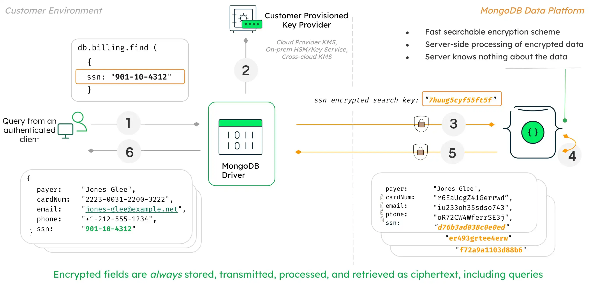

# perceptron-101



---

# How Simple Ideas Power Modern AI  
   
*Explore the magic of basic math and simple programming that make machines learn, all through the lens of the humble perceptron.*  
   
---  
   
## Introduction  
   
Imagine teaching a child to recognize fruits. You might say, "An apple is red and round, while a banana is yellow and long." The child uses these features to identify fruits in the future. Similarly, computers need a way to learn from features and make decisions. This is where the **perceptron** comes in—a simple yet powerful concept that forms the foundation of modern artificial intelligence (AI).  
   
In this blog post, we'll journey through the world of perceptrons, understand their origins, and demystify the elegant math behind them without diving into complex formulas. We'll use easy analogies and simple Python code to make these ideas accessible to everyone, regardless of age or background.  
   
---  
   
## The Origin of the Perceptron  
   
The perceptron was introduced by **Frank Rosenblatt** in 1957. Inspired by the way the human brain works, Rosenblatt wanted to create a machine that could mimic how neurons process information. Neurons receive inputs, perform simple calculations, and decide whether to activate or not. Rosenblatt's perceptron was a digital model of this biological process.  
   
---  
   
## Why the Perceptron Still Matters Today  
   
You might wonder, "Why should we care about a concept from the 1950s?" The answer is simple: the perceptron is the building block of **neural networks**, which are at the heart of modern AI technologies like voice assistants, facial recognition, and self-driving cars. Understanding the perceptron helps us grasp how machines learn and make decisions.  
   
---  
   
## The Perceptron Mechanics: The Magic of Simple Math  
   
At its core, a perceptron makes decisions by performing a straightforward calculation:  
   
1. **Receives inputs**: These are pieces of information or features (like test scores or pixel values in an image).  
2. **Applies weights**: Each input is multiplied by a number called a "weight," which signifies the importance of that input.  
3. **Calculates the weighted sum**: All the weighted inputs are added together, sometimes with an extra number called "bias" that shifts the result.  
4. **Makes a decision**: If the total is above a certain threshold, the perceptron "activates" (outputs a 1); if not, it doesn't activate (outputs a 0).  
   
### Dot Product vs. Weighted Sum: The Same Magic Trick  
   
You might hear about something called a **dot product** in math. Think of it as a way to quickly calculate the weighted sum. Instead of multiplying and adding each input separately, the dot product streamlines the process into a single step. It's like adding multiple items to your shopping cart with one click instead of adding them individually.  
   
---  
   
## An Analogy: Voting in a Group Decision  
   
Imagine a group of friends deciding whether to watch a movie. Each friend has a preference (input), and some friends' opinions matter more than others (weights). Here's how it works:  
   
- **Alice's vote counts twice** because she's a movie buff (weight of 2).  
- **Bob's vote counts once** (weight of 1).  
- **Charlie's vote counts half** because he's indifferent (weight of 0.5).  
   
Each friend expresses their preference:  
   
- **Alice wants to watch the movie** (input of 1).  
- **Bob doesn't want to watch it** (input of 0).  
- **Charlie is okay with watching it** (input of 1).  
   
To make a group decision, they combine their weighted preferences. This is where the **dot product** comes into play:  
   
- Multiply each friend's input by their weight:  
  - Alice: \(1 x 2 = 2\)  
  - Bob: \(0 x 1 = 0\)  
  - Charlie: \(1 x 0.5 = 0.5\)  
- Add up the results (weighted sum):  
  - Total score: \(2 + 0 + 0.5 = 2.5\)  
   
They have a threshold of 2 points to decide to watch the movie. Since the total score is 2.5, which exceeds the threshold, they decide to watch the movie.  
   
**How the Dot Product Fits In**  
   
The dot product is the operation of multiplying each friend's preference by their weight and summing the results. In our analogy:  
   
- **Inputs vector**: Friends' preferences \([1, 0, 1]\)  
- **Weights vector**: Friends' weights \([2, 1, 0.5]\)  
- **Dot product**: \( (1 x 2) + (0 x 1) + (1 x 0.5) = 2 + 0 + 0.5 = 2.5 \)  
   
The dot product simplifies combining multiple inputs and weights into a single calculation, just like the perceptron combines features and their importance to make a decision.  
   
---  
   
## A Simple Python Example: Predicting If a Student Passes  
   
Let's see how a perceptron works with a practical example. We'll predict whether a student passes based on two test scores.  
   
### The Scenario  
   
- **Test 1 Score**: Importance is moderate.  
- **Test 2 Score**: Importance is high.  
- **Passing Threshold**: Adjusted based on difficulty.  
   
### Step-by-Step Guide  
   
1. **Define the inputs**: The student's scores.  
2. **Set the weights**: Reflecting the importance of each test.  
3. **Set the bias**: Adjusts the passing threshold.  
4. **Calculate the weighted sum**: Multiply inputs by weights and add them up.  
5. **Apply the activation function**: Decide pass or fail.  
   
### Here's the Code  
   
```python  
# Step 1: Inputs - the student's test scores  
inputs = [85, 90]  # Test 1 and Test 2 scores  
   
# Step 2: Weights - importance of each test  
weights = [0.4, 0.6]  # Test 1 is less important than Test 2  
   
# Step 3: Bias - adjusts the passing threshold  
bias = -80  # Negative bias lowers the threshold needed to pass  
   
# Step 4: Calculate the weighted sum  
weighted_sum = sum(i * w for i, w in zip(inputs, weights)) + bias  
# This multiplies each input by its weight and adds them up, then adds the bias  
   
# Step 5: Activation function - determines pass or fail  
def activation_function(x):  
    return 1 if x >= 0 else 0  # 1 means pass, 0 means fail  
   
# Get the final result  
output = activation_function(weighted_sum)  
   
# Display the result  
if output == 1:  
    print("The student has passed.")  
else:  
    print("The student has failed.")  
```  
   
---  
   
## Breaking Down the Code with Analogies  
   
- **Inputs and Weights**: Think of the student's scores as ingredients in a recipe, and the weights as how much each ingredient contributes to the final taste.  
- **Weighted Sum**: Mixing the ingredients according to the recipe to get the batter.  
- **Bias**: The secret ingredient that adjusts the flavor, making the dish spicier or sweeter.  
- **Activation Function**: The taste test. If the flavor meets or exceeds the desired standard, the dish is approved (pass). If not, it's back to the kitchen (fail).  
   
---  
   
## Making It Easy to Understand
   
1. **Multiply Inputs by Weights**:  
  
   - Test 1: Score of 85 multiplied by weight 0.4 → 34  
   - Test 2: Score of 90 multiplied by weight 0.6 → 54  
   
2. **Add the Results**:  
  
   - Total before bias: 34 + 54 = 88  
   
3. **Add the Bias**:  
  
   - Total after bias: 88 + (-80) = 8  
   
4. **Apply the Activation Function**:  
  
   - Since 8 is greater than or equal to 0, the student passes.  
   
---  
   
## Experiment Yourself!  
   
Try changing the scores, weights, or bias to see how they affect the outcome.  
   
### Example: Adjusting the Passing Threshold  
   
- **New Bias**: Let's make the bias -100 to raise the passing threshold.  
   
```python  
bias = -100  # Now it's harder to pass  
   
# Recalculate the weighted sum  
weighted_sum = sum(i * w for i, w in zip(inputs, weights)) + bias  
   
# Get the new result  
output = activation_function(weighted_sum)  
   
# Display the new result  
if output == 1:  
    print("With a higher threshold, the student has passed.")  
else:  
    print("With a higher threshold, the student has failed.")  
```  
   
**What happens now?** The total after bias is 88 + (-100) = -12. Since -12 is less than 0, the student fails under the new threshold.  
   
---  
   
## The Fundamentals: Understanding the Elegant Math  
   
The perceptron's power lies in combining simple operations:  
   
- **Multiplication**: Adjusting each input by its weight.  
- **Addition**: Combining these adjusted inputs.  
- **Thresholding**: Deciding whether the total is enough to trigger an action.  
   
These are operations we use in daily life without thinking. When budgeting, we might multiply the cost of items by their quantities and sum them to see if we can afford them. The perceptron uses the same idea but applies it to learning from data.  
   
---  
   
## The Magic Behind the Scenes: How Simple Math Enables Learning  
   
### Adjusting Weights to Learn  
   
Just as a child adjusts their understanding based on feedback ("I thought all dogs are big, but small dogs exist too!"), a perceptron can adjust its weights when it makes mistakes. This learning process involves:  
   
- **Checking the Output**: Did the perceptron make the correct decision?  
- **Updating Weights**: If not, slightly adjust the weights to improve future decisions.  
   
Over time, the perceptron becomes better at making accurate predictions.  
   
---  
   
## Patterns in Hype Cycles: Lessons from the Perceptron's History  
   
The perceptron has experienced peaks and valleys in popularity:  
   
- **Initial Excitement**: In the 1950s and 60s, the perceptron was hailed as a breakthrough that would lead to thinking machines.  
- **Setbacks**: Realizing its limitations dampened enthusiasm. Critics pointed out problems it couldn't solve.  
- **Revival**: Advances in computing power and algorithms breathed new life into perceptron-based models, leading to today's AI boom.  
   
**The Lesson**: Even simple ideas can lead to significant advancements over time. Persistence and innovation can unlock the potential of foundational concepts.  
   
---  
   
## Conclusion  
   
The perceptron might seem modest—a simple model using basic math—but it's a cornerstone of AI. By understanding how a perceptron works, we appreciate how machines can learn from data, make decisions, and improve over time.  
   
The magic lies not in complex formulas but in the elegant interplay of simple operations. Whether you're a student, a teacher, or just curious, the perceptron offers a window into the fascinating world of machine learning.  
   
---  
   
## Explore Further  
   
- **Experiment with Code**: Modify the Python example to predict other outcomes, like weather forecasts or game results.  
- **Learn about Neural Networks**: See how stacking perceptrons leads to deep learning models.  
- **Connect to Real Life**: Consider how weighing different factors helps in making personal decisions.  

---

# FULL CODE

```
# Step 1: Define the input vector (student's scores)  
inputs = [85, 90]  # Test 1 score: 85, Test 2 score: 90  
  
# Step 2: Initialize weights (importance of each test)  
weights = [0.4, 0.6]  # Weight for Test 1: 0.4, Test 2: 0.6  
  
# Step 3: Define the bias (adjusts the passing threshold)  
bias = -80  # This scalar shifts the decision point  
  
# Step 4: Calculate the weighted sum  
weighted_sum = inputs[0]*weights[0] + inputs[1]*weights[1] + bias  
# Alternatively, use the dot product:  
#weighted_sum = sum(i * w for i, w in zip(inputs, weights)) + bias  
  
# Step 5: Define the activation function  
def activation_function(x):  
    if x >= 0:  
        return 1  # Pass  
    else:  
        return 0  # Fail  
  
# Step 6: Get the perceptron output  
output = activation_function(weighted_sum)  
  
# Step 7: Display the result  
if output == 1:  
    print("The student has passed.")  
else:  
    print("The student has failed.")
```
